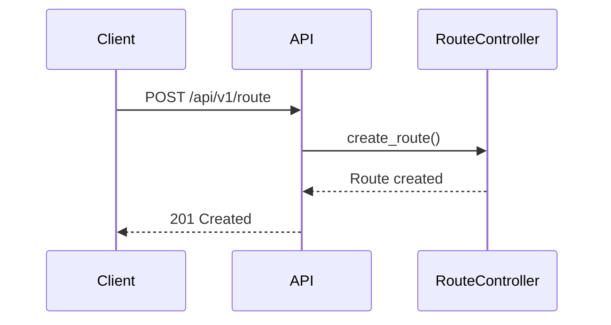

# Diagramme de séquence — EcoRide API

Illustration de la requête `POST/api/v1/route`.

```mermaid

sequenceDiagram
    participant Client
    participant API
    participant RouteController

    Client->>API: POST /api/v1/route
    API->>RouteController: create_route()
    RouteController-->>API: Route created
    API-->>Client: 201 Created
```